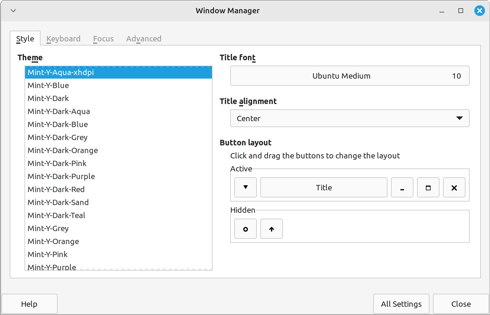

# Mint-Y-Aqua (xhdpi)

Linux Mint 21.3 Xfce is missing a high dpi window manager theme.

This is my attempt to fix that.

This theme is based on [mmolch-xfce (xhdpi)](https://github.com/mmolch/mmolch-xfce) and [Ambiance-hidpi](https://www.xfce-look.org/p/1149740/).

## Preview

## Installation

Click on "Code" and "Download ZIP".

Extract the downloaded zip-file to one of this folders:

- user folder: `~/.local/share/themes`
- system folder (needs root permissions): `/usr/share/themes`

Open "Settings Manager" > "Window Management" and choose "Mint-Y-Aqua (xhdpi)".
