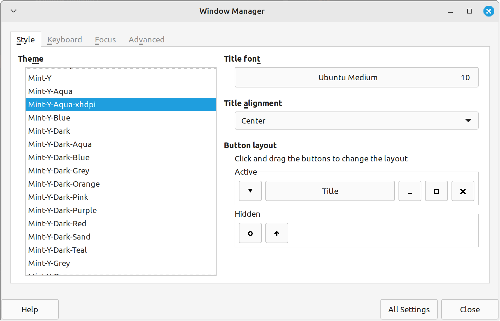

# Mint-Y-Aqua (xhdpi)

Linux Mint 21.3 Xfce is missing a high dpi window manager theme.

To create the Xfce window manager theme I did:

```bash
cd Mint-Y-Aqua/xfwm4
find . -type f -name "*.png" | xargs mogrify -sample 200%
```

And fixed the close buttons.

## Preview



## Installation

Click on "Code" and "Download ZIP".

Extract the downloaded zip-file to one of these folders:

- user folder: `~/.local/share/themes`
- system folder (needs root permissions): `/usr/share/themes`

Open "Settings" > "Window Manager" and choose "Mint-Y-Aqua-xhdpi".

## Links

- [command line - How can I scale an xpm image, retaining symbolic colour names - Stack Overflow](https://stackoverflow.com/questions/57739388/how-can-i-scale-an-xpm-image-retaining-symbolic-colour-names/57772401#57772401)
